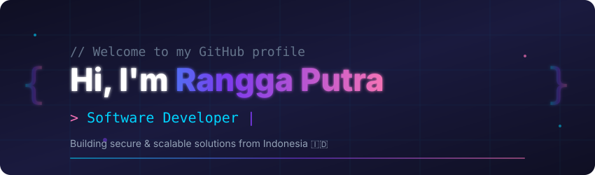
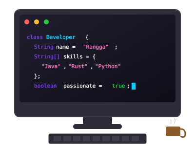

<!-- Profile Header -->
<div align="center">
  
</div>

<!-- Badges Row -->
<div align="center">
  
  
  [](https://github.com/dansiapa?tab=followers)
  
</div>

<br/>

<!-- About Me Section -->
<h2 align="center">
  
  About Me
</h2>

```yaml
name: Rangga Putra
role: Software Developer | Solution Architect | Consultant
location: Indonesia 🇮🇩
experience: 5+ Years | 20+ Projects | 4 Companies

summary: |
  Passionate about designing and delivering end-to-end software solutions
  that solve real business problems. Creator of open-source enterprise-grade
  security and infrastructure platforms.

focus_areas:
  - Backend Development & System Architecture
  - API Gateway & Security Architecture
  - Database Design & Optimization
  - CI/CD Pipeline & DevOps Practices
  - Infrastructure Security & Compliance

currently_learning:
  - Cloud Architecture (AWS)
  - Microservices Patterns
  - AI/ML Integration for Security

fun_fact: "I debug with coffee ☕ and solve problems in my sleep 💤"
```

<br/>

<!-- Featured Projects Section -->
<h2 align="center">
  
  Featured Open Source Projects
</h2>

<br/>

<!-- NAWALA Ecosystem Banner -->
<div align="center">
  
```
╭─────────────────────────────────────────────────────────────────────────╮
│                                                                         │
│                        NAWALA ECOSYSTEM                                 │
│              Sanskrit-inspired Modern Infrastructure                    │
│                                                                         │
│    ┌───────────────┐   ┌───────────────┐   ┌───────────────┐           │
│    │   SANCHALA    │   │    NAWALA     │   │    RAKSHA     │           │
│    │      OS       │   │    Gateway    │   │   Security    │           │
│    │     संञ्चल     │   │      नवल      │   │     रक्षा     │           │
│    └───────────────┘   └───────────────┘   └───────────────┘           │
│                                                                         │
╰─────────────────────────────────────────────────────────────────────────╯
```

[](https://github.com/nawala-team)

</div>

<br/>

<div align="center">
<table>
<tr>
<td align="center" width="33%" valign="top">

### 💻 Sanchala OS

**v1.0 "Astra" ⚡**

<p>
  
  
</p>
<p>
  
  
</p>

✨ **Key Features:**
- 🎨 macOS-inspired UI/UX
- 🔒 8-layer Security Architecture
- 📦 100% Linux Compatible
- 🔄 Btrfs Snapshots & Recovery
- 🌐 Sanchala Browser Built-in

<br/>

[](https://github.com/nawala-team/sanchala-os)

</td>
<td align="center" width="33%" valign="top">

### 🔐 Nawala Gateway

**Enterprise API Gateway**

<p>
  
  
</p>
<p>
  
  
</p>

✨ **Key Features:**
- 🛡️ Web Application Firewall
- 🔐 OAuth2 & JWT Auth
- ⚡ Rate Limiting & Throttling
- 🔍 AI Anomaly Detection
- 🔒 AES-256-GCM Encryption

<br/>

[](https://github.com/nawala-team/nawala-gateway-platform)

</td>
<td align="center" width="33%" valign="top">

### 🛡️ Raksha Security

**Security Monitoring Platform**

<p>
  
  
</p>
<p>
  
  
</p>

✨ **Key Features:**
- 📋 CIS, NIST, PCI-DSS Compliance
- 🤖 ML Threat Detection
- 🔗 SIEM Integration
- 🌑 Dark Web Monitoring
- 🍯 Honeypot System

<br/>

[](https://github.com/nawala-team/raksha-security-platform)

</td>
</tr>
</table>
</div>

<br/>

---

<br/>

<!-- Tech Stack Section -->
<h2 align="center">
  
  Tech Stack & Tools
</h2>

<br/>

<div align="center">
  
</div>
<br/>
<div align="center">
  
</div>
<br/>
<div align="center">
  
</div>
<br/>
<div align="center">
  
</div>

<br/>

---

<br/>

<!-- GitHub Stats Section -->
<h2 align="center">
  
  GitHub Stats
</h2>

<br/>

<p align="center">
  
</p>

<p align="center">
  
  
  
</p>

<br/>

<div align="center">
  
</div>

<br/>

<div align="center">
  
</div>

<br/>

---

<br/>

<!-- What I Bring Section -->
<h2 align="center">
  
  What I Bring to the Table
</h2>

<div align="center">
<table>
<tr>
<td align="center" width="33%">
  <br/>
  <br/><br/>
  <strong>Development</strong><br/><br/>
  <sub>Building robust backend systems with clean architecture and security-first approach</sub>
  <br/><br/>
</td>
<td align="center" width="33%">
  <br/>
  <br/><br/>
  <strong>Solution Design</strong><br/><br/>
  <sub>Translating complex requirements into scalable enterprise-grade solutions</sub>
  <br/><br/>
</td>
<td align="center" width="33%">
  <br/>
  <br/><br/>
  <strong>Delivery</strong><br/><br/>
  <sub>End-to-end project delivery from analysis to production deployment</sub>
  <br/><br/>
</td>
</tr>
</table>
</div>

<br/>

---

<br/>

<!-- Random Dev Quote -->
<h2 align="center">
  
  Random Dev Quote
</h2>

<div align="center">
  
</div>

<br/>

<!-- Connect Section -->
<h2 align="center">
  
  Let's Connect
</h2>

<div align="center">
  <a href="https://dansiapa.github.io/portofolio">
    
  </a>
  &nbsp;
  <a href="https://github.com/dansiapa">
    
  </a>
  &nbsp;
  <a href="mailto:ranggaputra12343@gmail.com">
    
  </a>
  &nbsp;
  <a href="https://linkedin.com/in/dansiapa">
    
  </a>
</div>

<br/>

<!-- Footer Animation -->
<div align="center">
  
</div>

<br/>

<!-- Footer -->
<div align="center">
  
</div>

<div align="center">
  <sub>Part of the <strong>Nawala Ecosystem</strong> — Sanskrit-inspired tools for modern infrastructure</sub>
</div>

